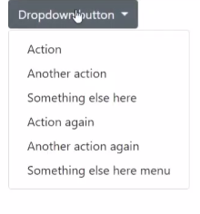
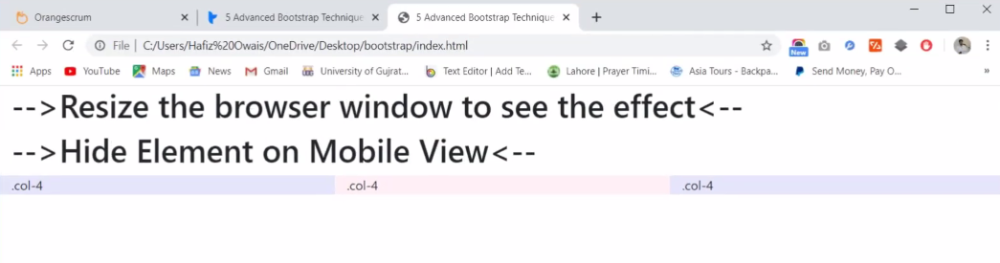
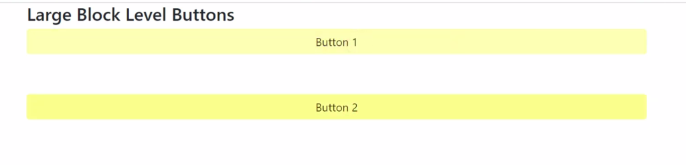
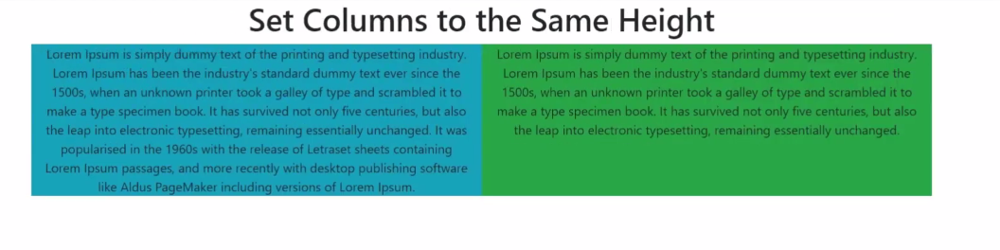
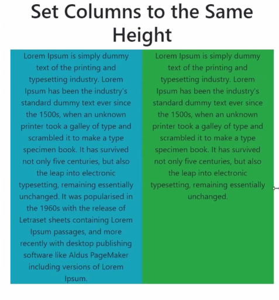

# 5-Advanced-Bootstrap-Techniques

<h2>Technique # 1</h2>
Set the Nav Bar to Open By Hovering
 


 
 Only two things will need to be changed in order to achieve this goal.

First, add the following CSS rule to your stylesheet after loading Bootstrap’s CSS. 

       
```
@media only screen and (min-width: 768px) {
  .dropdown:hover .dropdown-menu {
    display: block;
  }
}
```
Next, we need to add a quick line of JS code to change the dropdown links “On Click” behavior.  

```
$('.dropdown-toggle').click(function(e) {
  if ($(document).width() > 768) {
    e.preventDefault();

    var url = $(this).attr('href');

    if (url !== '#') {
      window.location.href = url;
    }

  }
});
```

<h2>Technique # 2</h2>

Set responsive video embeds to maintain aspect ratio
  
  Simply add the following code to your markup. 
```
<!-- 16:9 aspect ratio -->
<div class="embed-responsive embed-responsive-16by9">
    <iframe class="embed-responsive-item" src="//www.youtube.com/embed/QOoxfVSXaoQ"> </iframe>
</div>

<!-- 4:3 aspect ratio -->
<div class="embed-responsive embed-responsive-4by3">
    <iframe class="embed-responsive-item" src="//www.youtube.com/embed/j1M5RPunrHQ"> </iframe>
</div>
  ```
<h2>Technique # 3</h2>

Hide Elements On Mobile



If you need to quickly hide an element only on an xs device, you can use the ```.hidden-xs class.```

In a similar fashion, you can use the``` .hidden-(breakpoint) class ```for the rest of the breakpoints and use ```.hidden-lg,.hidden-md, and .hidden-sm.```


<h2>Technique # 4</h2>

Extend Existing classes...don't override      



Here’s the code that you would use to create a flat yellow button. 

```
.btn-yellow {
  background: rgb(250, 255, 140);
  color: #574500;
  border: none;
  -moz-box-shadow: none !important;
  -webkit-box-shadow: none !important;
  box-shadow: none !important;
 /* !important tags aren't necessarily always bad */
}
.btn-yellow:hover, .btn-yellow:focus {
  background: rgb(252, 255, 179);
}
.btn-yellow:active {
  background: rgb(247, 255, 71);
}
 ```       
<h2>Technique # 5</h2>

How to set colums to the same height



Here’s an example of the code you would use. 
              

/* display this row with flex and use wrap (= respect columns' widths) */
  ```
  .row-flex {
  display: -webkit-box;
  display: -ms-flexbox;
  display: flex;
  -ms-flex-wrap: wrap;
  flex-wrap: wrap;
}
```

/* vertical spacing between columns */

```
[class*="col-"] {
  margin-bottom: 30px;
}

.content {
  height: 100%;
  padding: 20px 20px 10px;
  color: #fff;
}
```


<b>For more useful articles or blogs visit our website: https:</b>

//www.mobitsolutions.com/blog

<h1>About Us:</h1
 
web design agency uk | wordpress development london |
wordpress development company in uk

https://www.mobitsolutions.com/website-design-development/
